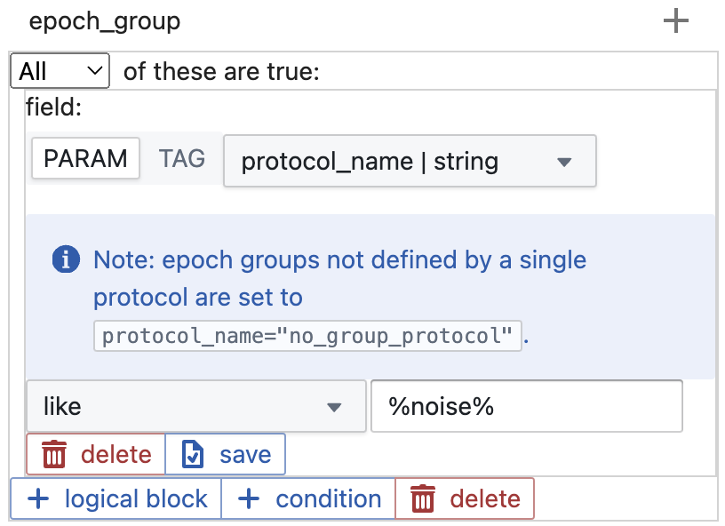

# datajoint

### Downloading dependencies I

To use this web app, you will need to download (make sure you add all of these to your `$PATH`):

- Python package manager: [Poetry](https://python-poetry.org/docs/#installation)
> Honestly, the best way to download this is to install [Brew](https://brew.sh/) and just run `brew install poetry`. This will automatically add poetry to `PATH` which is an important step.
- [Python 3.9](https://www.python.org/downloads/release/python-396/) (there is an issue with datajoint-ssl interfacing with versions >=3.10, so use newer versions at your own risk!)
> Have multiple versions of python? This [page](https://python-poetry.org/docs/managing-environments/) provides tips on how to specify the version you're using. If you installed `python3.9` via another environment, the `path/to/python` may be different (for example, [conda](https://docs.anaconda.com/working-with-conda/ide-tutorials/python-path/) instructions).
- Database server: [Docker](https://docs.docker.com/desktop/)
> This runs your datajoint server. Use the desktop app to view and modify running connections (only run one at a time!)
- Web app utilities: [Nodejs](https://nodejs.org/en)
> This should also automatically install `npm`. Ensure this is in your `PATH`.

### Downloading dependencies II

Next, for the app to run smoothly, run the following commands (at the repository root):

- `mkdir databases`: this is where databases will be stored
- `poetry install`: gets all python dependencies
> make sure you aren't already in a virtual environment, this is all designed to run outside a python shell. If you use conda, `conda config --set auto_activate_base false` prevents activation by default.
- `cd next-app`: this is where the app itself runs.
- `npm install`: gets all javascript dependencies. most warnings here can be ignored.

### Launching the app

To run the app, launch Docker Desktop, mount any necessary external storage, ensure you are in `/next-app`, and run:

``` npm run dev ```

You should be able to view the app at http://localhost:3000/. The terminal window will then track actions: this is useful to view the status of datajoint commands, and for debugging.

## 1. Setting up the database


First, add a database that you want to work with. Each one runs independently, so you can interact with them separately. Then, click the start button to spin up your instance. Once that is done, click the connect button (link icon) to connect.

> note: this sometimes doesn't work the first time you start a database:


> If this is the case, you may have to wait a couple minutes to connect. This is because it takes a while for Docker to actually connect to the port, depending on how much memory it has allocated, because of some first-time set up steps. You can track this by viewing logs for your container via Docker desktop: set up is not complete until you see the line `mysqld: ready for connections.`

Once connected, you can set a user. This is used for tagging. If you don't want to type this in every time, you can set a default by changing `username: str = "guest"` in `api/app.py` to your desired username.

## 2. Adding data

There must be at least one experiment to query, and you can come back to this screen and add more at any point. You must paste in the full path for the directories you select.

For example, if using the testbed:

- data: `/Volumes/data/datajoint_testbed/data`
- meta: `/Volumes/data/datajoint_testbed/meta`
- tags: `/Volumes/data/datajoint_testbed/tags`

If using your own directories, this is what each one should consist of (make sure that each experiment shares a file name across the three directories):

- data (`*.h5`): H5 files for all single-cell experiments
- meta (`*.json`): json files for all experiments, generated by `parse_data.py`
- tags (`*.json`): json files for all experiments. If no tags added yet, set all files to `{}` (empty)

The process of adding data can take a while (upto a minute per experiment). You can view the status of the process in the terminal window.

> `api/helpers/utils.py` currently has harcoded paths for `NAS_DATA_DIR` and `NAS_ANALYSIS_DIR`. If you have MEA data, make sure these paths are accurate to where your data and analysis directories are mounted.

## 3. Querying data

Finally, you can query your data. This works through a system of nested logical blocks and conditions, which should allow for practically any query.

At each level, you can query on table parameters or tags. If you choose to query on variable parameters (json attributes), you will have to specify the data type yourself.

Querying on string values gives you additional options: like and not like. You can use `%` as a wildcard to construct broad queries. For example, to find all epoch groups where the protocol ran was some form of noise:



Make sure you click the save button for each condition in case there are unsaved changes! To confirm you query is correct, you can use the "peek at QueryObj" button to view a neatly formatted and copyable query object:


> Note: in the future you'll be able to paste this in and re-run previous queries.

If you're viewing lots of data, it can take a while for the results to load. To speed this up (or if you just don't want to see certain levels), you can unselect any level using the checkbox next to its name. For example, if you are just trying to find specific experiments, you can unselect all the other levels (queries on hidden levels will still apply).

> Note: if the experiment level is hidden, you will not be able to push/pull tags (since this is done by experiment).

You can add additional filters using the checkboxes (will add more). For example, marking "hide excluded" will hide any epochs with the `exclude` tag. Once you are happy with your query, click View Results to run!

## 4. Viewing results

Currently, a query will return a tree of results matching your criteria. You can navigate it with the plus and minus icons:


Once you type something in the tagging input box, you can select any level(s) to add/remove tags with that name. These tags will be associate with the username you signed in with. You can use the select/unselect/select children options to make this easier.

> Currently, to view/refresh changes in tags, you must reclick the "View Results" button in the left panel. Be aware that this may change your results if you filtered by tags in your query!

Additionally, the bottom-right panel shows all metadata that datajoint has for the item clicked most recently. You can use this to find more things to query on.

The top-right panel will be used for summary visualizations of whatever object was last clicked. The visualizations currently supported:

* Epoch level: spike traces for each device (single-cell experiments only)
* Block level: spike distributions calculated by each algorithm (mea only)

> More visualizations will be added in the future, as well as making it easier to add your own via python.

## 5. Exporting results/tags


There are multiple download options once you have queried. The in-browser option instantly gives you the raw tree (exactly what you see in the GUI) as JSON, downloaded through the browser.

The other options write to a `downloads/` folder in the repository (you can change the location in `/api/app.py`). They are marked with a timestamp. You can choose to include:

- Just the raw tree
- Include full object metadata from datajoint
- Include levels that aren't selected to be shown in the GUI
- Both!

Once you start the download, it will run in the background (it can take a while depending on your query). You can track the progress in the terminal.

> In the future, chunk and analysis data for MEA (which are already in the database!) should also be displayed and be available to export.

When you add/delete tags, these changes are only saved in your current database. If you want to upload the tags you've created, or download new tags someone else has added, these changes must be imported/exported to `/tags/`. There are three options, and they will only apply to experiments that are currently in your results tree:

- Push: exports your changes to `/tags/`. This includes any tags with your username that were deleted/added, but you cannot overwrite tags from other users.

- Pull: import tags made by other users from `/tags/`. This is useful if someone added tags after you created your database, works like a "refresh" button.

- Reset: import tags made by *all* users from `/tags/`. This operation both pulls tags from other users, and overwrites any local changes you made (to your tags) with the last copy you exported.

> Again, these operations apply to all experiments in your current query. If you only want to push/pull/reset for a certain experiment, create a query with only that one. If you want to operate on the entire database, create a query that just returns all experiments, and then use these options.

## 6. Cleaning up

It is good practice to go back to the select database screen and stop the database you were using. If that's too much work, you can always open Docker Desktop and manually stop and/or delete any running containers later. You can only have one connection at a time, so if you allow these to accumulate you may run into issues (it will also eat up your memory!)

Finally, you can stop running the web app by navigating back to the terminal and running `Ctrl+C`.